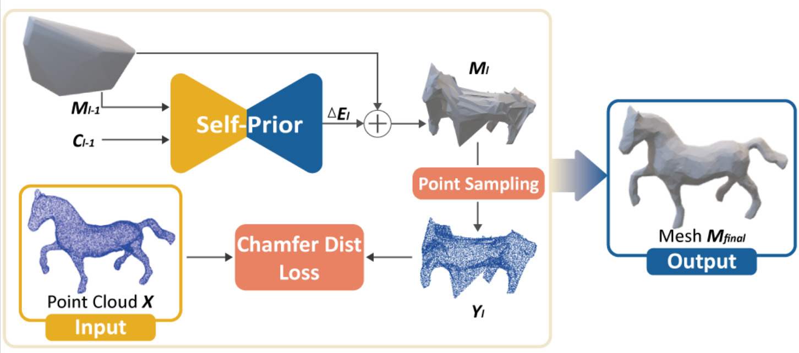
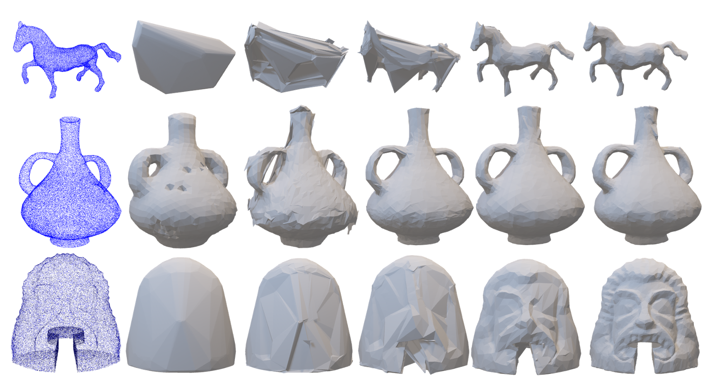

# Point2Mesh-CS492-A-
Point2Mesh implementation for KAIST 2022 Spring CS492(A)
## How does it work?

## Some results!

## How to use it?
First clone the repo

```
git clone https://github.com/rooknpown/Point2Mesh-CS492-A-.git
cd Point2Mesh-CS492-A-
```
Set environment running below

```
conda env create -f environment.yml
conda activate ptom
```
Note that depending on your GPU the cuda and pytorch version may differ.

Install Manifold here
https://github.com/hjwdzh/Manifold


Set paths and parameters in run.yaml
pcpath: path for point cloud ply file
initmeshpath: path for initial mesh of the given object
savepath: path for saving mesh output 
manifoldpath: path for the Manifold installed above. set the build folder location (~/Manifold/build)

Run the code by

```
python run.py
```
## Dataset Creation
You can create your own pointclouds from mesh using authors/mesh_sampler.py. Set number of points, input path and output path in authors/mesh_sampler.yaml.

You can get initial mesh from pointcloud by running dataprocessing/initial_mesh_generation.py 

## Dataset
Dataset we used is avaiable in data/ as input pointcloud - initial mesh pair. 

The result mesh is at checkpoints/

## References
Borrowed data from

Thingi10k https://ten-thousand-models.appspot.com/

COSEG http://irc.cs.sdu.edu.cn/~yunhai/public_html/ssl/ssd.htm

A Large Dataset of Object Scans http://redwood-data.org/3dscan/

Point2Mesh https://github.com/ranahanocka/point2mesh/blob/master/scripts/get_data.sh


Borrowed code for

watertight manifold https://github.com/hjwdzh/Manifold

mesh :https://github.com/ranahanocka/point2mesh

and MeshCNN : https://github.com/ranahanocka/MeshCNN

Specifically, **The codes in authors/ folder are codes modified from original code https://github.com/ranahanocka/Point2Mesh/ and https://github.com/ranahanocka/MeshCNN**.


Everything else are implemented ourselves.

## Notes on Irreproducible experiments of the original paper
Some experiments of the original paper(https://github.com/ranahanocka/point2mesh/) were not reproducible due to lack of information or resource constraint.
Experiments of Figure 3, 16, 17 of the original paper did not have enough explanation on the algorithm to reproduce the results. 
For Figure 11 we didn’t have a scanner nor the data from it. 
The table at page 11 was not reproducible as the specific 50 configurations were not provided.
Also, classifying noisy or detailed was done manually by the author which is qualitative and likely to be different from our standard.
